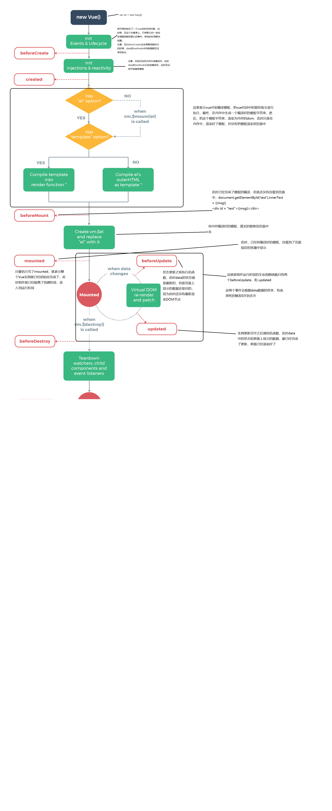

### v-for 按条件匹配

当用户在input框中输入一串字符串，表单响应式筛选出相关信息

在使用v-for循环遍历数组的时候，循环遍历一个方法，这个方法用于查询原数组存在的对象，找到之后就push到一个新数组，并返回这个新数组，实现动态筛选表格

- 当vue的实例被创建好之后，生命周期函数在beforeUpdate(),和updated()中，所以更改通过vm 修改model中的数据，model也能通过vm直接渲染view，v-for则可以将新数据重新加载到view中

```html
<div id="app">
    <div>
    	<label for="">搜索关键字</label>
        <input type="text" class="form-control" id = "search" v-model="keywords" v-focus>
    </div>
	<table class="table tabel-bordered table-hover table-striped">
        <thead>
            <tr>
                <th>Id</th>
                <th>Name</th>
                <th>添加时间</th>
                <th>operation</th>
            </tr>
        </thead>
        <tbody>
            <tr v-for="(item,index) in search(keywords)" :key="item.id">
                <td>{{item.id}}</td>
                <td>{{item.name}}</td>
                <td>{{item.time | dataFormat('yyyy-mm-dd')}}</td>
                <td>
                    <a href="#" @click.prevent="deleteIt(item.id)">删除</a>
                </td>
            </tr>
        </tbody>
    </table>
</div>
<script>
    var vm = new Vue({
        el:'#app',
        data:{
            list:[{
                id:'1',
                name:'a'
            },{
                id:'2',
                name:'b'
            }],
            keywords:null
        },
        methods:{
            search(keywords=‘’){
                if(keywords == ''){
                    return this.list;
                }else{
                    let newList = [];
                    this.list.forEach(item=>{
                        if(item.name.indexOf(keywords)!=-1){
                            newList.push(item);
                        }
                    });
                    return newList;
                }
            }
        }
    })
</script>
```

### 全局过滤器

vue设置全局过滤器，filter：

使用filter定义全局指令

其中第一个参数为过滤器的名称

第二个参数为过滤方法

过滤方法中第一个参数为需要过滤的字符串(形参)

第二个参数为其他需要传入的参数

```javascript
Vue.filter('dataFormat',function(dataStr,param){
    let dt = new Date(dataStr);
     var year = dt.getFullYear();
     var month = dt.getMonth()+1;
     var day = dt.getDate();
     return `${year}-${month}-${day}`;
});
//调用方法，使用 '|'
// <p>{{new Date() | dataFormat(param)}}</p>
```

### 私有过滤器

vue设置私有过滤器 filters:{}，使用方法与全局一样

但是定义私有过滤器有两个条件，必须要有名称以及处理函数

```html
<script>
    var vm = new Vue({
        el:'#app',
        data:{},
        methods:{},
        filters:{
            dataFormat(dataStr,param){
                let dt = new Date(dataStr);
                let y = dt.getFullyear();
                let m = dt.getMonth()+1;
                let d = dt.getDate();
                return `${y}-${m}-${d}`;
            }
        }
    })
</script>
<div id = "app">
    <p>{{new Date()| dataStr(param)}}</p>
</div>
```

*过滤器调用的时候采用的是就近原则，如果私有过滤器和全局过滤器一致，这时候优先调用私有过滤器*

> 不管是全局还是私有过滤器都可以实现链式调用，当过滤函数A执行完之后会将A返回的函数继续给B执行，直到执行完成

### padStart&&padEnd

自动在字符串前，后补充设置的字符

```html
<!DOCTYPE html>
<html lang="en">
<head>
    <meta charset="UTF-8">
    <meta name="viewport" content="width=device-width, initial-scale=1.0">
    <meta http-equiv="X-UA-Compatible" content="ie=edge">
    <script src="https://cdn.jsdelivr.net/npm/vue@2.6.10/dist/vue.js"></script>
    <title>Document</title>
</head>
<body>
    <div id="app">
        {{new Date() | dataFormat}}
    </div>
    <script>
        var vm = new Vue({
            el:'#app',
            data:{
                msg:'hello world'
            },
            filters: {

                // String.prototype.padStrart()
                // String.prototype.padEnd()
                dataFormat(msg,pattert=''){
                    let dt = new Date(msg);
                    let year = dt.getFullYear();
                    let month = (dt.getMonth()+1).toString().padStart(2,'0');
                    let day = dt.getDate().toString().padStart(2,'0');
                    return `${year}-${month}-${day}`;

                }
            }
        })
    </script>
</body>
</html>
```

### 全局指令

使用**directive**定义全局指令，其中：

*其中参数1：指令的名称，注意在指令的名称前面不需要加v-的前缀，在调用的时候，必须在调用指令的名称前，加上V-前缀来调用*

*参数2: 是一个对象，在对象上，有一些指令相关的函数，这些函数可以在特定的阶段，执行相关的操作*、

*所有的指令不管你的名称是什么，最后都创建好都必须要在其前面添加v-*

钩子函数实例

```javascript
Vue.directive('focus',{
	bind:function(el){
		//每个函数中第一个参数都是el，el表示绑定指令的元素，这个el对象是一个原生js对象
		// 每当指令绑定到元素上的时候，会立即执行这个bind函数，只执行一次
		//在元素刚绑定指令的时候，还没有插入到dom中去，这时候调用focus方法没有作用
	},
	inserted:function(){
		//inserted表示元素插入到DOM的时候，会执行inserted[触发一次]
	},
	updataed:functio(){
		//当VNode更新的时候汇之星update，可执行多次
	}
})
```

具体事例(创建一个全局设置颜色的指令**v-color**)

```javascript
 Vue.directive('color',{
     //样式，只要通过指令绑定给了元素，不管这个元素有没有被插入到页面中去，这个元素肯定有一个内联的样式
     //将来元素肯定会显示到页面中，这时候，浏览器渲染引擎必然会解析样式，应用给这个元素
     bind(el,binding){  //el 指代当前被选中的dom元素
         console.log(binding);
         el.style.color = binding.value;
     }
 });
```

其中第二个参数中的方法有bind，inserted，updated

一个指令定义对象可以提供如下几个钩子函数 (均为可选)：

- `bind`：只调用一次，指令第一次绑定到元素时调用。在这里可以进行一次性的初始化设置。
- `inserted`：被绑定元素插入父节点时调用 (仅保证父节点存在，但不一定已被插入文档中)。
- `update`：所在组件的 VNode 更新时调用，**但是可能发生在其子 VNode 更新之前**。指令的值可能发生了改变，也可能没有。但是你可以通过比较更新前后的值来忽略不必要的模板更新

### 私有指令

与私有过滤器类似，只是添加的对象为directives:{}

```javascript
var vm = new Vue({
    el:'#app',
    data:{},
    methods:{},
    directives:{
        'fontweight':{
            bind(el){
                
            },
            inserted(el){
                
            },
            update(el){
                
            },
        },
        fontsize(el,param){ //指令函数简写形式，bind 和 update 时触发相同行为，而不关心其它的钩子
            //等同于写入到bind和update中
            el.style.fontSize = param.value +"px"; 
        }
    }
})
```

### 键值修饰符

- .enter
- .tab
- .delete(捕获删除或退格)
- .esc
- .space
- .up
- .down
- .left
- .right

```html
<input type="text"  vlaue = "示例" @keyup.enter="function">
```

自定义全局按键修饰符，前提是直到键盘对应的码值

```javascript
Vue.config.keyCodes.f2 = 113
```

### vue实例的生命周期

什么是生命周期？

从Vue实例创建，运行，到销毁期间，总是伴随各种各样的事件，这些事件统称为生命周期

**生命周期钩子**：就是生命周期事件的别名而已

主要的生命周期函数：

- 创建期间的生命周期函数
  	- beforeCreate：实例刚在内存中被创建出来，此时，还没有初始化好data和methods属性
  	- created：实例已经在内存中创建完毕，此时data和methods已经创建成功，此时还没有开始编译模板
  	- beforeMount: 此时已经完成了模板的编译，但是还没有挂载到页面中
  	- mounted：此时，已经将编译好的模板，挂载到了页面指定的容器中显示
- 运行期间的生命周期函数
  - beforeUpdate：状态更新之前执行此函数，此时data的状态值是最新的，但是页面上显示的数据还是旧的，因为此时还没有重新渲染DOM节点
  - updated:实例更新完毕之后调用此函数，此时data中的状态和界面上显示的数据，都已经完成了更新，界面已经渲染好了
- 销毁期间的生命周期函数
  - beforeDestory：实例销毁之前调用，在这一步，实例仍然可以完全可用
  - destroyed:Vue实例销毁后调用，调用后Vue实例只是的所有东西都会解绑定，所有的事件监听器都会被移除，所有的子实例也会被销毁




