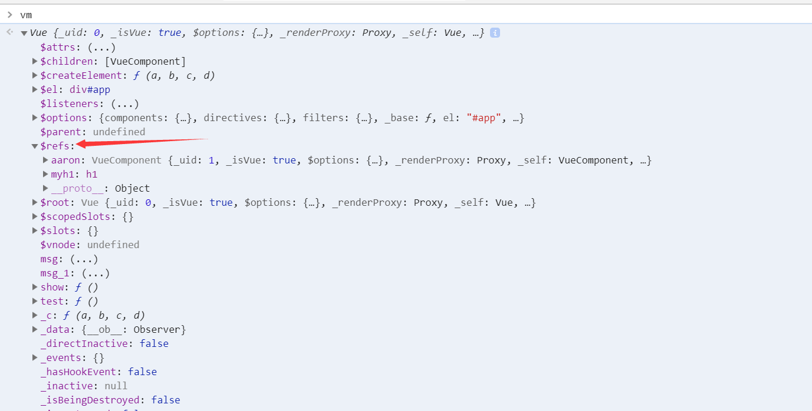

### refs 获取dom元素

在vue中不推荐使用document.getElementById()等方法获取dom元素，在vue中，当给标签中添加ref属性，就可以在控制台里打印vm实例，可以看到如下图所示



在vm实例中存在一个$refs属性，其中里面就包含了要操作的dom元素

使用方法：可以在new一个Vue中传入的对象使用this.$refs['你的ref']来获取此dom元素

```javascript
var vm = new Vue({
    el:'#app',
    data(){
        return {
            
        }
    },
    mounted(){
        console.log(this.$refs['myh1']);
	}
});
```

也可以在组件中添加ref属性，更改组件中data属性里的值

实例：

```html
<!DOCTYPE html>
<html lang="en">
<head>
    <meta charset="UTF-8">
    <meta name="viewport" content="width=device-width, initial-scale=1.0">
    <meta http-equiv="X-UA-Compatible" content="ie=edge">
    <script src="https://cdn.jsdelivr.net/npm/vue@2.6.10/dist/vue.js"></script>
    <title>Document</title>
</head>
<body>
    <div id="app">
        <input type="text" name="aa" id="aaa" v-focus>
        <input type="button" value="btn_parent" @click="test">
        <aaron ref="aaron"></aaron>

        <h1 ref="myh1">this is ref operate dom</h1>
    </div>
    <script>

        Vue.component('aaron',{
            template:'<div><h1>test{{msg}}{{msg_parent}}</h1><input type="button" value="btn"></div>',
            data(){
                return{
                    msg:'666'
                }
            },
            methods:{
               
            },

        });
        var vm = new Vue({
            el:'#app',
            data () {
                return {
                    msg:'hello world',
                    
                }
            },
            methods: {
                test(){
                    this.$refs['myh1'].innerHTML = 'edit it';
                    console.log(this.$refs['aaron']);
                    this.$refs['aaron'].msg = '777';
                    this.msg = "aaaaaaaa"
                }
            }
        });


       
    </script>
</body>
</html>
```


### vue 中的router模块

#### 后端路由

对于普通网站，所欲的超链接都是url地址，所有的url地址都对应服务器上对应的资源

#### 前端路由

对于单页面程序来说，主要通过url中的hash（#）来实现不同页面之间的切换，同时，hash有一个特点，http请求不会包含hash相关的呢绒，所以单页面程序中的页面跳转主要用hash实现

在单页面应用程序中，这种通过hash改变来切换页面的方式，称作前端路由（区别后端路由）

要使用vue中的路由，首先导入vue-router

```html
<script src="https://cdn.jsdelivr.net/npm/vue@2.6.10/dist/vue.js"></script>
<script src="https://unpkg.com/vue-router/dist/vue-router.js"></script>
```

> 注意：vue.js一定要在vue-router前加载

创建一个路由对象，当导入vue-router包之后，在window全局对象中，就有了一个路由的构造函数，叫做VueRouter
在new路由对象的时候，可以为构造函数传递一个配置对象

```javascript
var routerObj = new VueRouter({
    //route  //这个配置对象中的route表示【路由匹配规则】的意思
    routes:[ //路由匹配规则
    //每个路由规则，都是一个对象，这个规则身上，有两个必须的属性：
    //属性1是path,表示监听哪个路由链接地址
    //属性2是component,表示如果路由是前面匹配到的path，则展示component属性对应的那个组件
    //注意component的属性值，必须是一个组件的模板对象，不能是组建的引用名称
    { path: '/', redirect: '/login'},  //将根路径重定向到/login路径
    { path: '/login', component: login },
    { path: '/register', component: register }
    ],
    linkActiveClass: 'myactive'  //可将路由自带的类名改为myactive，设置样式
})
```

创建组件的模板对象

```javascript
var login = {
    template: '<h3>登录</h3>'
}
```

将路由规则对象注册到vm实例中

```javascript
var vm = new Vue({
    el: '#app',
    data: {},
    methods: {},
    //将路由规则对象，注册到vm实例上，用来监听URL地址的变化，然后展示对应的组件
    router: routerObj
})
```

使用router-view渲染路由对象组件

```html
<div id="app">
    <a href="#/login">登录</a>
    <a href="#/register">注册</a>
    <router-view></router-view>
</div>
```

#### 使用router-link&query方式传递参数

使用router-link切换路由地址

```html
<!-- router-link默认为a标签，即使被渲染为span但任然能点击 -->
<router-link to="/login" tag="span">登录</router-link>
<router-link to="/register">注册</router-link>
<router-view></router-view>
```

使用router-link传值

```html
<!--在链接中传递值-->
<router-link to="/login?id=11&name='ss'">登录</router-link>
```

在component对象中设置$.route.query值

```javascript
var login = {
    template: '<h3>登录--{{id}}--{{name}}</h3>',
    data() {
        return {
            id: this.$route.query.id,
            name: this.$route.query.name
        }
    },
    created(){
        console.log(this.$route.query.id);
    }
}
```

#### 使用param传值

将需要传值的规则写入path中

```javascript
var routerObj = new VueRouter({
    routes: [
        { path: '/login/:id/:name', component: login}
    ]
})
```

将传递的值写入路径中

```html
<router-link to="/login/12/11">登录</router-link>
```

在页面渲染出来，传递的值在params中

```javascript
var login = {
    template: '<h3>登录--{{id}}--{{name}}</h3>',
    data() {
        return {
            id: this.$route.params.id,
            name: this.$route.params.name
        }
    }
}
```

#### 使用children属性实现路由嵌套

```html
<!DOCTYPE html>
<html lang="en">
<head>
    <meta charset="UTF-8">
    <meta name="viewport" content="width=device-width, initial-scale=1.0">
    <meta http-equiv="X-UA-Compatible" content="ie=edge">
    <script src="https://cdn.jsdelivr.net/npm/vue@2.6.10/dist/vue.js"></script>
    <script src="https://unpkg.com/vue-router/dist/vue-router.js"></script>
    <title>Document</title>
    <style>
        *{
            margin: 0 0;
            padding: 0 0;
        }
    </style>
</head>
<body>
    <div id="app">
        <router-link to="/account">account</router-link>
        <router-view></router-view>
    </div>
    <template id="tmp1">
        <div>
            <h1>
                this is an account component
            </h1>
            <router-link to="/account/login">login</router-link>
            <router-link to="/account/register">register</router-link>
            <router-view></router-view>
        </div>
    </template>
    <script>
        // 组件模板对象
        var account = {
            template:'#tmp1'
        }

        var login = {
            template:'<h1>login</h1>'
        }

        var register = {
            template:'<h1>register</h1>'
        }

        var router = new VueRouter({
            routes:[{
                path:'/account',
                component:account,
                children:[{
                    // 使用children 属性实现子路由，同时，子路由的path前面不要带/,否则永远以根路径开始请求，这样不方便用户去理解url地址
                    path:'login',
                    component:login
                },{
                    path:'register',
                    component:register
                }]
            }],
        })
        var vm = new Vue({
            el:'#app',
            data:{

            },
            router:router
        })
    </script>
</body>
</html>
```

### watch属性

使用watch属性，可以监视data中指定数据的变化，然后触发这个watch中对应的function处理函数

```vue
data(){
    return {
        example0: "",
        example1: "",
        example2: {
            inner0: 1,
            innner1: 2
        }
    }
},
watch: {
    example0(newVal, oldVal){//监控单个变量
        ……
    } ，
    example2(newVal, oldVal){//监控对象
        ……
    } ，
}
```

### computed

在computed中，可以定义一些属性，这些属性叫做**[计算属性]** 其本质就是一个方法，只不过我们在使用这些计算属性的时候是把他们的名称直接当做属性来使用的，并不会把计算属性当做方法去调用

注意：

- 计算属性，在引用的时候一定不要加()去调用，直接把它当做普通属性去使用就好
- 只要是计算属性这个function内部，所用到的任何data中的数据发生了变化，就会立即重新计算这个计算属性的值
- 计算属性的求值结果会被缓存起来，方便下次直接使用；如果计算属性方法中，所依赖的任何数据都没有发生任何变化，则不会对计算属性重新求职


### `watch`、`computed`、`methods`之间的对比

- computed 属性会被缓存，除非依赖的响应式属性变化才会重新计算，主要当作属性来使用
- methods方法表示一个具体的操作，主要是写业务逻辑
- watch是一个对象，键是需要观察的表达式，值是对应的回调函数，主要用来监听某些特定数据的变化，从而进行某些具体的业务逻辑操作，可以看作是computed和watch的结合体


